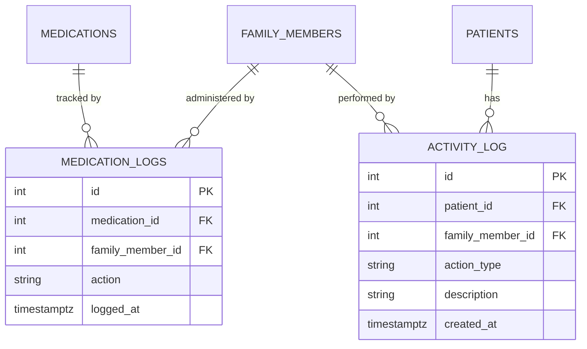
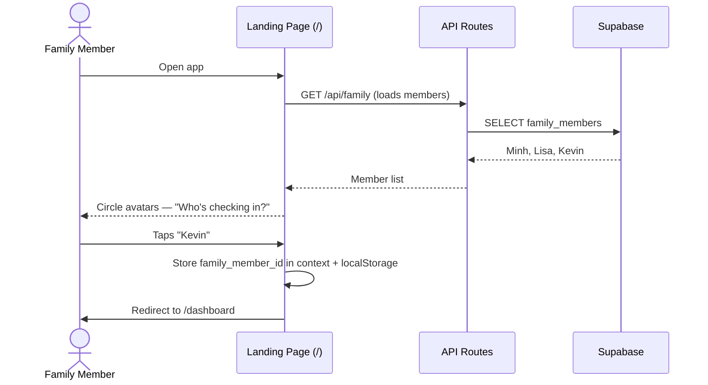
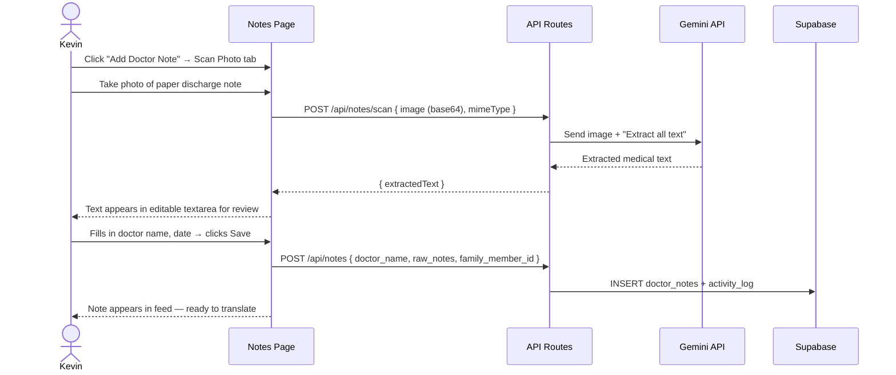
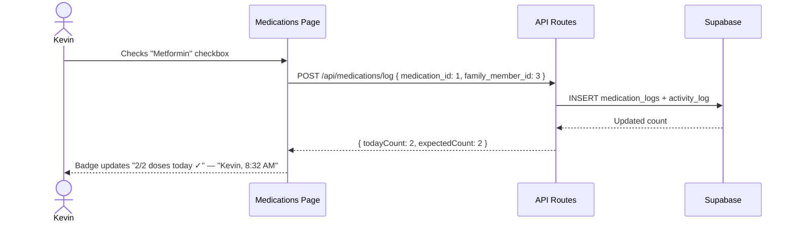
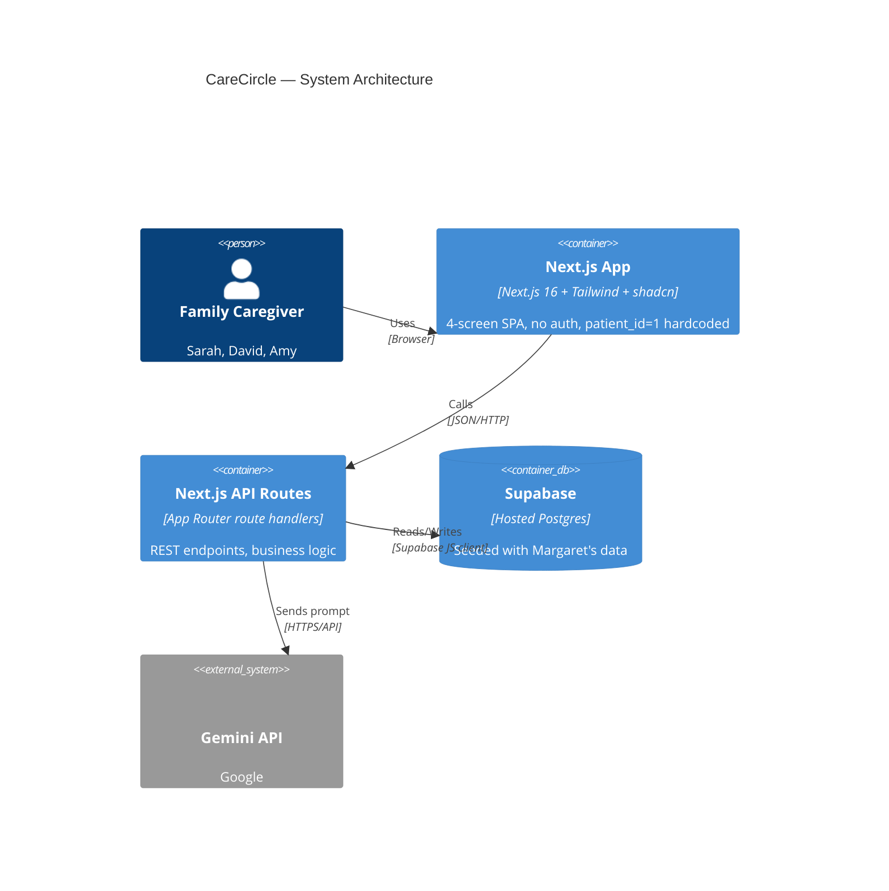
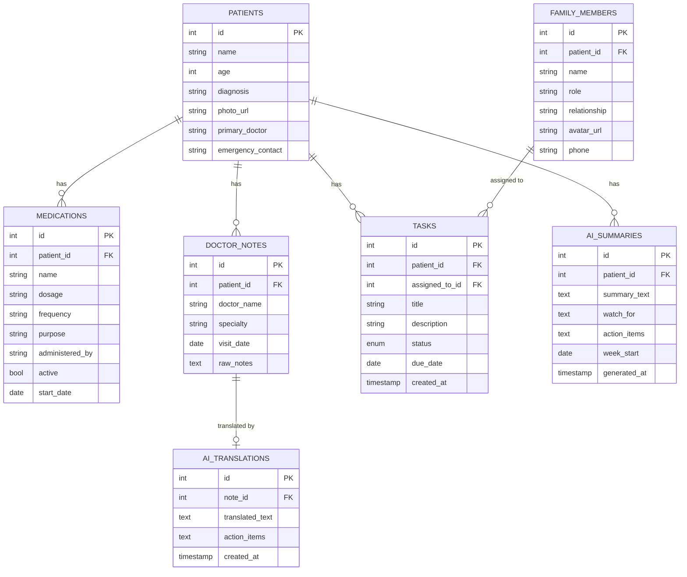
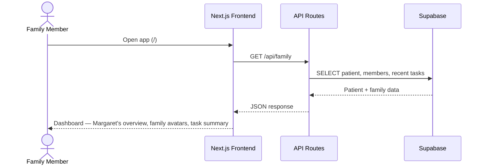
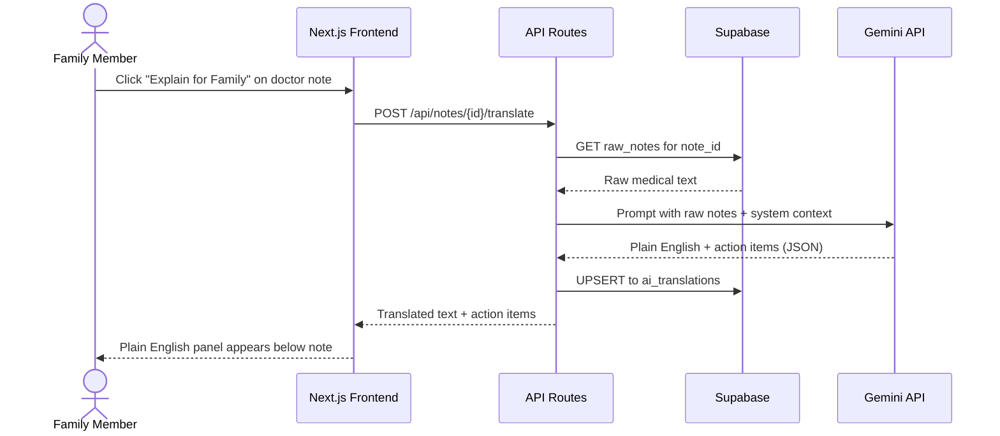
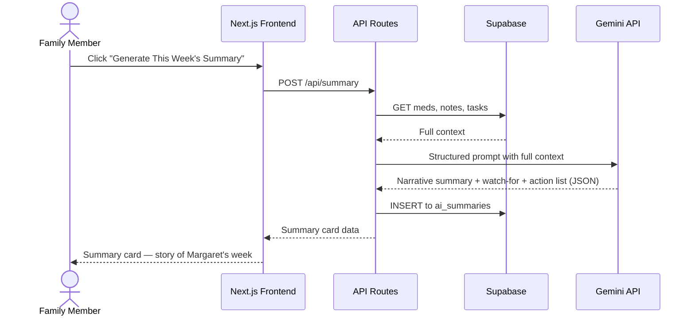

# CareCircle — Hackathon Build Plan

> Family care coordination app for serious illness management.
> Stack: Next.js 16.2.2 + Tailwind + shadcn/ui | Supabase | Google Gemini API
> Team: 3 people | Timeline: ~21 hours

---

## Hackathon: SHPE VIBRA ATL

**Prompt:** *Create a platform that helps Hispanic communities access education, healthcare, or learn more about new tech.*

**Our pillar:** Healthcare — specifically immigrant families navigating the U.S. medical system without English fluency.

**Prizes:** 1st $600 · 2nd $250 · 3rd $150

### Judging Rubric (20 pts total, 5 per category)

| Score | Innovation | Technical Execution | Presentation | Community Impact |
|---|---|---|---|---|
| **5** | Novel use of data or tech not seen in existing solutions | Clean code, real datasets, fully functional demo | Compelling, rehearsed; explains problem, solution & impact clearly | Addresses specific community need; practical and scalable |
| **4** | Creative fresh angle; builds meaningfully beyond existing ideas | Mostly functional; good data integration with minor bugs | Good; covers key points with smooth demo | Clearly benefits community; evidence of research into real needs |
| **3** | Some creative elements but largely follows familiar patterns | Core features work; some bugs; basic but appropriate data use | Covers the basics; demo works but delivery is uneven | Plausible benefit; connection to real needs is underdeveloped |
| **2** | Closely mirrors existing tools; little originality shown | Significant bugs or limited features; data use is superficial | Hard to follow; unclear problem or demo is missing/broken | Vague or assumed need; little evidence solution would help |
| **1** | Generic idea; does not stand out in any meaningful way | Minimal working code; project is largely incomplete | Little effort; judges can't understand what was built or why | No clear connection to Hispanic community challenges or data |

### How CareCircle targets each criterion

| Criterion | Our angle |
|---|---|
| **Innovation** | Photo scan → AI medical translation in 10 languages + activity attribution without auth — judges won't have seen this combination |
| **Technical Execution** | Gemini 2.5 Flash (multimodal OCR + translation) + Supabase + Next.js fully integrated end-to-end with real data and full CRUD |
| **Presentation** | "Kevin is 19. He works at Best Buy. He shouldn't be translating his grandmother's oncology notes." — emotional, personal, rehearsed |
| **Community Impact** | 38% of Hispanic adults have no regular doctor. 72% speak a language other than English at home. Discharge note misunderstanding = readmission. |

---

## Core Concept

One shared place for a family managing a loved one's serious illness:
- Medication tracker
- Doctor visit notes (with AI plain-English translation)
- Task assignments across family members
- AI weekly summary that tells the whole story

**Demo persona:** Bà Nguyễn Thị Lan (Lan Nguyen), 70, Type 2 Diabetes + Hypertension. Immigrated from Vietnam 3 years ago. Speaks no English.
Family: Minh (son, care coordinator, first-gen American), Lisa (daughter-in-law), Kevin (grandson, 19 — used to be the family "translator").

---

## V2 Features (Added 2026-04-04)

> **These features build ON TOP of everything below.** Original plan is unchanged.
> Person C pushes all V2 backend + route changes before A and B start building UI.

### What changed from V1

| Original | V2 |
|---|---|
| Dashboard at `/` | User selection at `/`, dashboard moves to `/dashboard` |
| Read-only medications | Full CRUD + checklist with live dose counts |
| Read-only tasks | Full CRUD with activity attribution |
| Read-only doctor notes | Add notes manually OR scan a photo of a paper note |
| No user identity | Family member selection (no auth, stored in browser) |
| No activity tracking | Every action logged with who + when |
| Summary in English only | Summary translatable to 10 languages |
| Gemini 2.0 Flash | Gemini 2.5 Flash (2.0 deprecated) |

---

### V2-A: User Selection (No Auth)

**Problem:** The original plan hardcoded everything with no sense of "who is using the app." For the demo, we need actions attributed to specific family members.

**Solution:** A user selection screen at `/` — circular avatar cards (Google account picker style) for each family member. Tap one → stored in React context + localStorage → redirected to `/dashboard`.

**Route changes:**
- `/` → User selection landing page
- `/dashboard` → Dashboard (moved from `/`)

**New files:**
| File | Purpose |
|---|---|
| `src/lib/user-context.tsx` | React context: `{ user, setUser }`, reads from localStorage |
| `src/app/page.tsx` | Rewritten as user selection (circle avatars + "Add Member" button) |
| `src/app/dashboard/page.tsx` | Dashboard (moved from old `/`) |
| `src/app/api/family/members/route.ts` | POST to add a new family member |

**Nav changes (`src/app/layout.tsx`):**
- Shows "Logged in as [Name]" + avatar in top nav
- "Switch" link → returns to `/`

**How user identity flows:**
1. User selects their profile → `family_member_id` stored in context
2. Pages call `const { user } = useUser()` from `@/lib/user-context` to get the current member
3. Every mutating API call (POST, PATCH, DELETE) must include `family_member_id: user.id` in the request body or query params
4. Backend logs the action to `activity_log` table with who did it

---

### V2-B: Activity Logging

**New DB tables** (run in Supabase SQL Editor):

```sql
-- Tracks every action: who did what, when
create table activity_log (
  id serial primary key,
  patient_id int references patients(id),
  family_member_id int references family_members(id),
  action_type text not null,
  description text not null,
  created_at timestamptz default now()
);

-- Tracks each medication dose: who gave it, when
create table medication_logs (
  id serial primary key,
  medication_id int references medications(id),
  family_member_id int references family_members(id),
  action text not null default 'administered',
  logged_at timestamptz default now()
);
```

> **Remember:** Disable RLS on both new tables.

**New API routes:**

| Route | Methods | Purpose |
|---|---|---|
| `/api/activity` | GET, POST | Fetch recent activity feed; log a new action |
| `/api/medications/log` | GET, POST | Fetch dose logs for today; confirm a dose was given |

**Activity types logged:**

| Action | Example log entry |
|---|---|
| Task completed | "Kevin marked 'Set up glucose log' as completed" |
| Task created | "Minh added task 'Schedule follow-up'" |
| Medication confirmed | "Kevin confirmed Metformin at 8:32 AM" |
| Note added | "Minh added doctor note from Dr. Tran" |
| Note scanned | "Lisa scanned a discharge note from Dr. Park" |
| Summary generated | "Minh generated this week's summary" |

---

### V2-C: Full CRUD — Tasks

**Changes to `src/app/api/tasks/route.ts`** (currently has GET + status-only PATCH):

| Method | What's new |
|---|---|
| POST | `{ title, description?, assigned_to_id, due_date, family_member_id }` → creates task + logs to activity_log |
| PATCH | Expanded: accepts `{ id, family_member_id, title?, description?, assigned_to_id?, due_date?, status? }` → logs status changes |
| DELETE | `?id=N` query param → deletes task + logs to activity_log |

**Dashboard UI (`src/app/dashboard/page.tsx`):**
- PatientCard, FamilyAvatars, MedCountBadge
- Task list with: "Add Task" button → Dialog, toggle complete, Edit, Delete
- **Activity feed** at bottom — recent actions from `/api/activity`

---

### V2-D: Full CRUD — Medications + Dose Tracking

**Changes to `src/app/api/medications/route.ts`** (currently GET only):

| Method | What's new |
|---|---|
| POST | `{ name, dosage, frequency, purpose, administered_by, start_date, family_member_id }` → creates med + logs |
| PATCH | `{ id, family_member_id, ...any fields including active }` → updates med + logs |
| DELETE | `?id=N` query param → deletes med + logs |

**New: `src/app/api/medications/log/route.ts`**
- GET `?date=YYYY-MM-DD` → all dose logs for that day with who + when
- POST `{ medication_id, family_member_id }` → confirms dose was given

**Medications UI (`src/app/medications/page.tsx`) — Checklist style:**
- Each med = a **checklist card** (not a table row):
  - Checkbox to mark as given → POST to `/api/medications/log`
  - Med name, dosage, frequency, purpose
  - **Live count badge**: "2/3 doses today" (today's logs vs expected frequency)
  - Last given: "Kevin, 8:32 AM"
  - Edit button, Delete button, active toggle
- **Top of page: progress bar** — "12 of 14 doses given today" across all meds
- "Add Medication" button → Dialog

**How to calculate the progress bar:**
1. Fetch all active meds from `GET /api/medications` (filter where `active === true`)
2. Fetch today's logs from `GET /api/medications/log?date=YYYY-MM-DD`
3. Parse each med's `frequency` string to get expected daily doses:
   - `"Twice daily..."` → 2
   - `"Once daily..."` → 1
   - `"Three times daily..."` → 3
   - Default to 1 if unsure
4. Total expected = sum of all active meds' expected doses (e.g. Metformin 2 + Lisinopril 1 + Amlodipine 1 + Atorvastatin 1 = 5)
5. Total given = count of today's logs
6. Progress bar value = total given / total expected
7. The POST to `/api/medications/log` returns `{ todayCount }` for that specific med — use it to update the count badge without refetching

---

### V2-E: Doctor Notes — Add Note + Photo Scan

**Changes to `src/app/api/notes/route.ts`** (currently GET only):
- POST: `{ doctor_name, specialty, visit_date, raw_notes, family_member_id }` → creates note + logs

**New: `src/app/api/notes/scan/route.ts`**
- POST: `{ image: string (base64), mimeType: string }`
- Sends image to Gemini 2.5 Flash (multimodal) → extracts text
- Returns `{ extractedText: string }` for user to review before saving

**New Gemini function (`src/lib/gemini.ts`):**
```typescript
export async function extractTextFromImage(base64Data: string, mimeType: string): Promise<string>
// Uses model.generateContent([textPart, { inlineData: { mimeType, data } }])
// Prompt: "Extract all text from this medical document exactly as written."
```

**Notes UI (`src/app/notes/page.tsx`) — add to existing:**
- "Add Doctor Note" button → Dialog with shadcn Tabs:
  - **Manual Entry** tab: Input (doctor, specialty, date), Textarea (raw_notes)
  - **Scan Photo** tab: file input with `accept="image/*" capture="environment"` (camera on mobile), image preview, "Extract Text" button → calls scan API → populates raw_notes Textarea for review/edit
  - **iPhone compatibility:** Must use `accept="image/*"` (not specific types) — iPhones send HEIC by default. Gemini supports HEIC, JPEG, PNG, WebP. The client reads the file as base64 via `FileReader.readAsDataURL()`, strips the `data:...;base64,` prefix, and sends `{ image: base64, mimeType: file.type }` to the API.
- After save: prepend to notes list, close dialog

**Demo story:** *"Minh takes a photo of Bà Lan's discharge paper. CareCircle reads it and explains it to the family — in Vietnamese."*

---

### V2-F: Summary Translation

**New: `src/app/api/summary/translate/route.ts`**
- POST: `{ text: string, language: string }` → calls Gemini to translate → returns `{ translatedText: string }`

**New Gemini function (`src/lib/gemini.ts`):**
```typescript
export async function translateText(text: string, language: string): Promise<string>
// Simple translation prompt, returns plain text
```

**Summary UI (`src/app/summary/page.tsx`) — add to existing:**
- Language selector (same 10 languages as notes page)
- "Translate" button → shows translated summary in colored panel below original

---

### V2 Project Structure (additions only)

```
src/
├── app/
│   ├── page.tsx                              # NEW: User selection landing
│   ├── dashboard/page.tsx                    # MOVED: Dashboard (was /)
│   └── api/
│       ├── family/members/route.ts           # NEW: POST add family member
│       ├── activity/route.ts                 # NEW: GET/POST activity log
│       ├── medications/log/route.ts          # NEW: GET/POST dose tracking
│       ├── notes/scan/route.ts               # NEW: POST photo → text (Gemini)
│       └── summary/translate/route.ts        # NEW: POST text translation
└── lib/
    ├── user-context.tsx                      # NEW: React context for active user
    └── languages.ts                          # NEW: Shared 10-language constant
```

### V2 Data Model (additions only)



### V2 User Flows

#### User Selection → Dashboard


#### Scan Paper Note → AI Translation


#### Medication Dose Confirmation


### V2 Demo Script Addition

> Insert after step 2 in the original demo script:

2b. *"When Kevin opens CareCircle, he picks his name. Everything he does — confirming a medication, completing a task — is logged so the whole family can see."* → show user selection → tap Kevin → show dashboard with activity feed

4b. *"Minh took a photo of the paper note from the doctor's office."* → show Scan Photo tab → upload image → text extracted → click Explain in Tiếng Việt → Vietnamese translation appears

6b. *"The weekly summary? Translate it too."* → show language selector on summary → translate to Vietnamese

### V2 Winning Criteria Additions

- [ ] User selection page shows 3 family member avatars + Add button
- [ ] Selecting a user → dashboard shows "Logged in as [Name]"
- [ ] Creating a task logs "Minh added task '...'" in activity feed
- [ ] Medication checklist shows live dose counts (2/2 ✓)
- [ ] "Confirm Given" on medication → logs who + when
- [ ] Photo scan: upload image → text extracted by Gemini
- [ ] Add Note from scan → note appears in feed, ready to translate
- [ ] Summary translatable to Vietnamese/Spanish/etc.
- [ ] Activity feed shows attributed actions on dashboard

---

## Key Differentiators vs. CareVillage

| Feature | CareVillage | CareCircle |
|---|---|---|
| AI | Generic chatbot | Context-aware medical translation + weekly summaries in 10 languages |
| Doctor notes | Document storage only | AI translation to plain language + **photo scan** (paper note → AI reads it) |
| Weekly digest | None | AI narrative summary, translatable to any supported language |
| Medication tracking | Basic list | Checklist with **live dose counts**, attributed to who gave each dose |
| Task management | Basic | Full CRUD with **activity attribution** — who did what, when |
| User identity | Login required | No auth needed — family member picker, actions logged per person |
| Activity feed | None | Full audit trail — "Kevin confirmed Metformin at 8:32 AM" |
| Languages | English only | 10 languages — Vietnamese, Spanish, Mandarin, Korean, Tagalog, Hindi, Arabic, Portuguese, French |
| Focus | General caregiving | Serious illness, **immigrant families**, medical-first |
| UX | Utilitarian | Emotionally designed — "Who's checking in?" not "Login" |

**What judges won't have seen elsewhere:**
1. **Photo scan → AI translate** — take a photo of a paper discharge note, AI reads it, explains it in the patient's native language
2. **Activity attribution without auth** — no login wall, but every action tracked per family member
3. **Multilingual medical translation** — not generic Google Translate, but medical jargon → plain language in 10 languages

**Pitch line:** *"Kevin is 19. He works at Best Buy. Every time his grandmother sees a doctor, he's handed a discharge note and asked to explain it to her — in Vietnamese — using words he doesn't understand in English. CareCircle fixes that."*

---

## Team Split

| Person | Responsibility |
|---|---|
| A | Frontend: Dashboard + Medication Tracker |
| B | Frontend: Doctor Notes + AI Summary Card |
| C | Backend: API routes + Supabase schema + Gemini integration |

---

## 5 Screens

1. **Family Dashboard** — patient overview, family members, recent activity
2. **Medication Tracker** — current meds, dosage, schedule, who's responsible
3. **Doctor Visit Notes** — chronological feed + multilingual AI translation button
4. **AI Weekly Summary** — Gemini-generated narrative digest card
5. **Community Resources** — curated Atlanta-area resources for immigrant families (static)

---

## Stack

| Layer | Tool | Purpose |
|---|---|---|
| Framework | Next.js 16.2.2 (App Router) | Frontend + API routes in one repo |
| Styling | Tailwind CSS + shadcn/ui | Consistent, professional UI |
| Database | Supabase (hosted Postgres) | Zero config, hosted, real-time capable |
| DB Client | `@supabase/supabase-js` | No ORM, direct queries |
| AI | Google Generative AI SDK + Gemini 2.0 Flash | Note translation + weekly summary |
| Deployment | Vercel | One-click deploy from GitHub |

### Environment Variables
```
# .env.local
NEXT_PUBLIC_SUPABASE_URL=https://xxxx.supabase.co
NEXT_PUBLIC_SUPABASE_ANON_KEY=eyJ...
GOOGLE_AI_API_KEY=AIza...
```

> **Next.js 16 warning:** `params` in dynamic route handlers MUST be awaited — synchronous access is fully removed. See API Routes section below. Read `node_modules/next/dist/docs/` before writing any route handler.

> **Supabase warning:** Disable Row Level Security (RLS) on all tables in the Supabase dashboard, or every query returns empty silently.

---

## System Architecture



---

## Project Structure

```
src/
├── app/
│   ├── page.tsx                              # Dashboard (/)
│   ├── medications/page.tsx                  # Medication Tracker
│   ├── notes/page.tsx                        # Doctor Notes
│   ├── summary/page.tsx                      # AI Weekly Summary
│   └── api/
│       ├── family/route.ts                   # GET overview
│       ├── medications/route.ts              # GET medications
│       ├── notes/route.ts                    # GET notes
│       ├── notes/[id]/translate/route.ts     # POST translate
│       └── summary/route.ts                  # POST generate / GET latest
├── components/                               # Shared UI components
└── lib/
    ├── supabase.ts                           # Supabase client singleton
    └── gemini.ts                             # Gemini prompt functions
```

---

## Data Model



---

## Phase 1 — Project Bootstrap (Hour 0–1)

### Commands
```bash
npx shadcn@latest init            # Default style, Slate, CSS variables
npx shadcn@latest add card badge button dialog table tabs avatar progress skeleton
npm install @supabase/supabase-js @google/generative-ai
```

### Supabase Setup (supabase.com)
1. Create new project → note URL + anon key → paste into `.env.local`
2. Dashboard → Authentication → RLS → **disable RLS on all tables**
3. Go to SQL Editor → run the schema SQL below
4. Run the seed SQL after schema

---

## Phase 2 — Database Schema (Hour 1)

Run in **Supabase SQL Editor:**

```sql
create table patients (
  id serial primary key,
  name text not null,
  age int not null,
  diagnosis text not null,
  photo_url text,
  primary_doctor text not null,
  emergency_contact text not null
);

create table family_members (
  id serial primary key,
  patient_id int references patients(id),
  name text not null,
  role text not null,
  relationship text not null,
  avatar_url text,
  phone text
);

create table medications (
  id serial primary key,
  patient_id int references patients(id),
  name text not null,
  dosage text not null,
  frequency text not null,
  purpose text not null,
  administered_by text not null,
  active boolean default true,
  start_date date not null
);

create table doctor_notes (
  id serial primary key,
  patient_id int references patients(id),
  doctor_name text not null,
  specialty text not null,
  visit_date date not null,
  raw_notes text not null
);

create table ai_translations (
  id serial primary key,
  note_id int unique references doctor_notes(id),
  translation text not null,
  action_items text not null,
  created_at timestamptz default now()
);

create table tasks (
  id serial primary key,
  patient_id int references patients(id),
  assigned_to_id int references family_members(id),
  title text not null,
  description text,
  status text default 'pending',
  due_date date,
  created_at timestamptz default now()
);

create table ai_summaries (
  id serial primary key,
  patient_id int references patients(id),
  summary_text text not null,
  watch_for text not null,
  action_items text not null,
  week_start date not null,
  generated_at timestamptz default now()
);
```

---

## Phase 3 — Seed Data (Hour 1–2)

Run in **Supabase SQL Editor** after schema. Verify patient gets `id=1` after insert.

```sql
-- Patient
insert into patients (name, age, diagnosis, primary_doctor, emergency_contact)
values (
  'Lan Nguyen (Bà Lan)',
  70,
  'Type 2 Diabetes + Hypertension',
  'Dr. Jennifer Tran (Primary Care)',
  'Minh Nguyen — (404) 555-0187'
);

-- Family members
insert into family_members (patient_id, name, role, relationship)
values
  (1, 'Minh Nguyen',  'Care Coordinator', 'Son'),
  (1, 'Lisa Nguyen',  'Support',          'Daughter-in-law'),
  (1, 'Kevin Nguyen', 'Support',          'Grandson');

-- Medications (realistic Type 2 Diabetes + Hypertension regimen)
insert into medications (patient_id, name, dosage, frequency, purpose, administered_by, start_date)
values
  (1, 'Metformin',        '1000 mg oral',  'Twice daily with meals', 'Controls blood sugar for Type 2 Diabetes',            'Minh (morning/evening)', '2024-11-01'),
  (1, 'Lisinopril',       '10 mg oral',    'Once daily (morning)',   'Lowers blood pressure and protects kidneys',          'Minh (morning)',         '2024-11-01'),
  (1, 'Amlodipine',       '5 mg oral',     'Once daily',             'Relaxes blood vessels to lower blood pressure',       'Minh (morning)',         '2025-01-10'),
  (1, 'Atorvastatin',     '20 mg oral',    'Once daily (evening)',   'Lowers cholesterol to reduce cardiovascular risk',    'Minh (evening)',         '2025-01-10');

-- Doctor notes (raw = intimidating jargon — the demo "before AI translation")
insert into doctor_notes (patient_id, doctor_name, specialty, visit_date, raw_notes)
values
  (1, 'Dr. Jennifer Tran', 'Primary Care', '2026-03-28',
   'Patient is a 70 y/o Vietnamese-speaking female presenting for chronic disease management follow-up. HbA1c 8.2% — suboptimal glycemic control. Fasting glucose 178 mg/dL. Counseled on carbohydrate restriction and dietary compliance. Metformin 1000mg BID continued. Consider referral to endocrinology if HbA1c does not improve to <7.5% by next quarter. BP 148/92 — above target. Titrate Lisinopril to 10mg and add Amlodipine 5mg QD. Renal function panel ordered — eGFR 61, CKD Stage 2, monitor closely. Annual diabetic foot exam performed — no neuropathy detected. Repeat HbA1c and BMP in 3 months.'),
  (1, 'Dr. Samuel Park', 'Endocrinology', '2026-03-14',
   'New patient referral for T2DM management. Reviewed current regimen — Metformin 1000mg BID appropriate. Patient reports polydipsia and occasional nocturia x2-3/night consistent with osmotic diuresis from hyperglycemia. Discussed self-monitoring of blood glucose (SMBG) — patient currently not monitoring at home. Recommend glucometer and glucose log. Target fasting glucose 80-130 mg/dL, post-prandial <180 mg/dL. If HbA1c remains above 8% at follow-up, will consider adding GLP-1 agonist. Nutritional counseling referral placed — low glycemic index diet emphasized. Return in 3 months with glucose log.'),
  (1, 'Dr. Maria Lopez', 'Podiatry', '2026-03-07',
   'Diabetic foot evaluation. No open wounds or ulcerations noted bilaterally. Monofilament testing intact at all 10 sites — protective sensation preserved. Mild callus formation plantar right heel, debrided in office. Patient ambulating without assistive device. Advised proper footwear — no open-toed shoes. Daily foot inspection reinforced. Patient relies on family member for translation — recommend professional interpreter for future visits. Annual vascular assessment: DP and PT pulses 2+ bilaterally. Low risk classification. Return in 12 months or sooner if wound develops.');

-- Tasks (mix of completed/pending)
insert into tasks (patient_id, assigned_to_id, title, description, status, due_date)
values
  (1, 1, 'Pick up blood pressure medication refill', 'CVS Pharmacy on Buford Hwy — Lisinopril + Amlodipine ready', 'completed', '2026-04-01'),
  (1, 3, 'Set up glucose monitoring log', 'Dr. Park wants Bà Lan to track fasting glucose daily — Kevin to help set up the app', 'pending', '2026-04-07'),
  (1, 2, 'Research low-glycemic Vietnamese recipes', 'Dr. Tran recommended low-carb diet — find pho and rice alternatives Ba will actually eat', 'pending', '2026-04-10'),
  (1, 1, 'Schedule endocrinology follow-up', 'Dr. Park wants to see her in 3 months with glucose log', 'pending', '2026-04-14'),
  (1, 1, 'Request professional interpreter for next appointment', 'Dr. Lopez noted Kevin should not be translating — ask clinic to arrange', 'pending', '2026-04-12');
```

---

## Phase 4 — Supabase Client (Hour 2)

**File:** `src/lib/supabase.ts`

```typescript
import { createClient } from '@supabase/supabase-js'

export const supabase = createClient(
  process.env.NEXT_PUBLIC_SUPABASE_URL!,
  process.env.NEXT_PUBLIC_SUPABASE_ANON_KEY!
)
```

---

## Phase 5 — Gemini Integration (Hour 2–4, Person C)

**File:** `src/lib/gemini.ts`

```typescript
import { GoogleGenerativeAI } from '@google/generative-ai'

const genAI = new GoogleGenerativeAI(process.env.GOOGLE_AI_API_KEY!)
const model = genAI.getGenerativeModel({ model: 'gemini-2.0-flash' })

function parseJSON(text: string) {
  // Strip markdown code fences if model ignores instruction
  const cleaned = text.trim().replace(/^```(?:json)?\n?/, '').replace(/\n?```$/, '')
  return JSON.parse(cleaned)
}

export async function translateNote(
  rawNotes: string, patientName: string, age: number,
  diagnosis: string, doctor: string, date: string
) {
  const prompt = `You are a compassionate medical translator helping a family understand their loved one's care.

Patient: ${patientName}, ${age}, ${diagnosis}
Doctor's note from ${doctor} on ${date}:
${rawNotes}

Translate this into warm, clear plain English for a family caregiver with no medical background.
- Use simple language
- Highlight anything that needs action TODAY
- Keep it under 200 words total
- End with "Questions to ask the doctor:" followed by 2-3 questions

Respond ONLY as valid JSON with no markdown, no code fences, no extra text: { "translation": "...", "actionItems": "..." }`

  const result = await model.generateContent(prompt)
  return parseJSON(result.response.text())
}

export async function generateWeeklySummary(params: {
  patientName: string, age: number, diagnosis: string,
  weekStart: string, medications: string,
  visitNotes: string, completedTasks: number, totalTasks: number
}) {
  const prompt = `You are summarizing a week of care for a family managing a loved one's serious illness.

Patient: ${params.patientName}, ${params.age}, ${params.diagnosis}
Week of: ${params.weekStart}
Medications: ${params.medications}
Doctor visits this week: ${params.visitNotes}
Tasks completed: ${params.completedTasks}/${params.totalTasks}

Write a warm, clear weekly summary for the whole family.
Include: (1) how ${params.patientName} did overall this week (2-3 sentences), (2) what to watch for next week, (3) top 3 action items for the family.
Tone: caring, clear, no jargon. Under 200 words.

Respond ONLY as valid JSON with no markdown, no code fences, no extra text: { "summaryText": "...", "watchFor": "...", "actionItems": "..." }`

  const result = await model.generateContent(prompt)
  return parseJSON(result.response.text())
}
```

---

## Phase 6 — API Routes (Hour 3–7, Person C)

### `src/app/api/family/route.ts`
```typescript
// GET: patient + familyMembers + recent 5 tasks + active med count
const { data: patient } = await supabase.from('patients').select('*').eq('id', 1).single()
const { data: members } = await supabase.from('family_members').select('*').eq('patient_id', 1)
const { data: tasks } = await supabase.from('tasks').select('*, family_members(name)').eq('patient_id', 1).order('due_date').limit(5)
const { count } = await supabase.from('medications').select('*', { count: 'exact' }).eq('patient_id', 1).eq('active', true)
```

### `src/app/api/medications/route.ts`
```typescript
// GET: all medications sorted active first
const { data } = await supabase.from('medications').select('*').eq('patient_id', 1).order('active', { ascending: false })
```

### `src/app/api/notes/route.ts`
```typescript
// GET: notes with translation joined
const { data } = await supabase.from('doctor_notes').select('*, ai_translations(*)').eq('patient_id', 1).order('visit_date', { ascending: false })
```

### `src/app/api/notes/[id]/translate/route.ts`
```typescript
import type { NextRequest } from 'next/server'

// Next.js 16: params MUST be awaited — synchronous access is removed
export async function POST(_req: NextRequest, ctx: RouteContext<'/api/notes/[id]/translate'>) {
  const { id } = await ctx.params  // ← await required in v16

  try {
    const { data: note } = await supabase.from('doctor_notes').select('*').eq('id', id).single()
    const result = await translateNote(note.raw_notes, note.doctor_name, /* ... */)
    await supabase.from('ai_translations').upsert({ note_id: id, ...result })
    return Response.json(result)
  } catch (err) {
    console.error('Gemini translate failed:', err)
    // Demo fallback — replace with real Gemini output after first successful run
    return Response.json({
      translation: "Dr. Anand reviewed Margaret's treatment today. She's in cycle 3 of 6 of her chemotherapy — right on schedule. Her heart and blood counts are being watched closely, and everything looks acceptable so far. She'll need a follow-up in about 3 weeks.\n\nQuestions to ask the doctor:\n1. What should we watch for between now and the next visit?\n2. Are there any diet changes that might help her energy?\n3. When will we know if the treatment is working?",
      actionItems: "Watch for signs of infection (fever, chills) — her white blood cell count is low. Next appointment in 21 days — make sure someone has a ride arranged."
    })
  }
}
```

### `src/app/api/summary/route.ts`
```typescript
// GET: return latest summary
export async function GET() {
  const { data: latest } = await supabase.from('ai_summaries').select('*').eq('patient_id', 1).order('generated_at', { ascending: false }).limit(1).single()
  return Response.json(latest)
}

// POST: fetch week context → call Gemini → save → return
export async function POST() {
  try {
    // fetch meds, notes, tasks for context...
    const result = await generateWeeklySummary({ /* ... */ })
    await supabase.from('ai_summaries').insert({ patient_id: 1, ...result, week_start: weekStart })
    return Response.json(result)
  } catch (err) {
    console.error('Gemini summary failed:', err)
    // Demo fallback — replace with real Gemini output after first successful run
    return Response.json({
      summaryText: "This was a significant week for Margaret. She completed her third cycle of chemotherapy — right on schedule — and her heart tests continue to look stable. She's been dealing with some fatigue and nausea, which is expected at this stage, but her spirits remain strong.",
      watchFor: "Watch for any signs of infection like fever or chills, as her white blood cell count is on the lower side. Also keep an eye on her appetite — Dr. Park wants to make sure she's eating enough to maintain her weight.",
      actionItems: "1. Pick up the Ondansetron refill at CVS.\n2. Schedule the heart scan before her next chemo cycle.\n3. Research high-protein meals Margaret might enjoy."
    })
  }
}
```

### `src/app/api/tasks/route.ts`
```typescript
// GET: tasks with assignee name
// PATCH: update task status
```

---

## Phase 7 — Pages (Persons A & B)

> **⚠️ V2 UPDATE:** This section is superseded by the V2 Features section above. Key changes:
> - Dashboard moved from `/` to `/dashboard` (landing page is now user selection)
> - Layout + nav already built — includes user avatar, active link highlighting, "Switch" link
> - Medications are **NOT read-only** — full CRUD + checklist with live dose counts
> - Doctor Notes need **"Add Note" dialog** with Manual Entry + Photo Scan tabs
> - Weekly Summary needs **language selector + translate** button
> - All pages should use `useUser()` to get current family member for API calls
>
> **Read V2-C through V2-F above for full specs.** The original specs below are kept for reference only.

### Page 1: Dashboard `/dashboard` — Person A
- `PatientCard` — name, age, diagnosis, primary doctor
- `FamilyAvatars` — shadcn Avatar row with name + role badge
- `TaskList` — **full CRUD**: add, edit, toggle complete, delete tasks (via dialogs)
- `MedCountBadge` — "4 active medications"
- `ActivityFeed` — recent actions from `/api/activity`: "Kevin confirmed Metformin at 8:32 AM"

### Page 2: Medication Tracker `/medications` — Person A
- **Checklist cards** (not table rows) — each med has a checkbox to confirm dose given
- **Live count badge** per med: "2/3 doses today" from `/api/medications/log`
- **Progress bar** at top: "12 of 14 doses given today" across all meds
- Last given: "Kevin, 8:32 AM"
- Add/Edit/Delete medication dialogs
- Active/inactive toggle

### Page 3: Doctor Notes `/notes` — Person B
- `NoteCard` per visit — doctor, specialty, date, raw note text
- "Explain for Family" button → POST to translate API (already working)
- `TranslationPanel` slides in: plain language + action items + questions to ask
- **"Add Doctor Note" button** → Dialog with shadcn Tabs:
  - **Manual Entry** tab: Input (doctor, specialty, date), Textarea (raw_notes)
  - **Scan Photo** tab: file input with `accept="image/*" capture="environment"`, image preview, "Extract Text" button → POST `/api/notes/scan` → populates raw_notes for review

### Page 4: AI Weekly Summary `/summary` — Person B
- If no summary: empty state + "Generate This Week's Summary" button
- Loading: animated skeleton card
- `SummaryCard`: narrative paragraph + "Watch For" section + action items list
- `WeekBadge`: "Week of April 6, 2025"
- **Language selector** (import from `src/lib/languages.ts`) + "Translate" button → POST `/api/summary/translate`
- Translated summary in colored panel below original

---

## Phase 8 — Multilingual AI Translation

### How it works
The `translateNote` function in `src/lib/gemini.ts` accepts a `language` parameter.
The translate API route reads `language` from the POST request body.
The notes page has a global language selector dropdown — one selection applies to all notes.

### Supported languages (demo)
| Language | Code passed to API |
|---|---|
| English | `English` |
| Vietnamese | `Tiếng Việt` |
| Spanish | `Español` |
| Mandarin | `中文` |
| Korean | `한국어` |
| Portuguese | `Português` |
| Tagalog | `Tagalog` |
| Hindi | `हिन्दी` |
| Arabic | `العربية` |
| French | `Français` |

### Caching behavior
- English translations are saved to `ai_translations` in Supabase (cached between sessions)
- All other languages are generated fresh on each request (no DB write — avoids schema complexity)
- If you want to cache other languages, you'd need a `language` column on `ai_translations`

### Demo flow
1. Open Doctor Notes page — language selector defaults to **Tiếng Việt**
2. Click "Explain in Tiếng Việt" on Dr. Tran's note
3. Gemini returns jargon → plain Vietnamese in ~6 seconds
4. Switch selector to English, click "Retranslate in English" — shows same note in English
5. Point out: *"Any immigrant family. Any language. Same 6 seconds."*

---

## Phase 9 — Community Resources Page

### What it is
A static page at `/community` — no API, no DB. Curated resources for immigrant families navigating healthcare in the Atlanta area.

### Content sections
1. **Free & Low-Cost Healthcare** — FQHCs, Grady, Georgia Charitable Care Network
2. **Your Right to an Interpreter** — federal law explainer (Title VI), Language Line
3. **Insurance & Coverage Help** — Medicaid, ACA Marketplace, GeorgiaCares
4. **Atlanta Community Organizations** — AAAJ-Atlanta, Latin American Association, New American Pathways

### Why it matters for judging
- Directly addresses "Community Impact" rubric criterion
- Shows the app goes beyond the immediate family to connect them with the broader support system
- 38% of Hispanic adults (and similar rates in other immigrant communities) have no regular doctor — this page helps them find one
- The interpreter rights card is the most important: *"You never need Kevin to translate. It's the law."*

### File
`src/app/community/page.tsx` — fully implemented as a static server component. No edits needed.

---

## Phase 10 — Deploy to Vercel (Hour 18–19)

```bash
git add . && git commit -m "feat: CareCircle hackathon build"
# Push to GitHub → vercel.com → Import → Add env vars → Deploy
```

**Env vars to add in Vercel dashboard:**
- `NEXT_PUBLIC_SUPABASE_URL`
- `NEXT_PUBLIC_SUPABASE_ANON_KEY`
- `GOOGLE_AI_API_KEY`

---

## User Flows

### View Dashboard


### Translate Doctor Note


### Generate AI Weekly Summary


---

## Critical Files

| File | Owner | Purpose |
|---|---|---|
| Supabase SQL Editor | C | Schema + seed (run manually) |
| `src/lib/supabase.ts` | C | DB client singleton |
| `src/lib/gemini.ts` | C | Both AI prompt functions |
| `src/app/api/notes/[id]/translate/route.ts` | C | Wow moment #1 |
| `src/app/api/summary/route.ts` | C | Wow moment #2 |
| `src/app/page.tsx` | A | Dashboard |
| `src/app/medications/page.tsx` | A | Med tracker |
| `src/app/notes/page.tsx` | B | Doctor notes + translate |
| `src/app/summary/page.tsx` | B | AI summary card |

---

## Hour-by-Hour Build Plan

| Hours | Person A | Person B | Person C |
|---|---|---|---|
| 0–1 | shadcn init + shared components setup | Pull repo | Supabase project + schema SQL |
| 1–2 | Layout + nav | Layout + nav | Seed SQL + `supabase.ts` |
| 2–5 | Dashboard page | Doctor Notes page | API routes (family, meds, notes) |
| 5–8 | Medication Tracker | AI Summary Card | `gemini.ts` + translate route |
| 8–11 | Connect to APIs | Connect to APIs | Summary route + tasks route |
| 11–14 | Loading states + polish | Translation animation + polish | End-to-end test all routes |
| 14–17 | Responsive check | Cross-browser check | Vercel deploy + env vars |
| 17–19 | Demo run-through x3 | Demo run-through x3 | Demo run-through x3 |
| 19–21 | Slides | Pitch story rehearsal | Final deploy check |

---

## Demo Script (2 min)

1. *"Meet Bà Lan — 70 years old, immigrated from Vietnam. She has diabetes and high blood pressure. She speaks no English."* → show dashboard
2. *"Her son Minh coordinates her care. Her grandson Kevin used to be her translator — a 19-year-old explaining a cardiologist's notes in words he doesn't understand himself."* → scroll family avatars, tasks
3. *"Her doctor sent discharge notes. Here's what they actually said."* → show raw medical jargon
4. *"Here's what CareCircle tells her family — in Vietnamese."* → click "Explain in Tiếng Việt" → show plain Vietnamese translation
5. *"Switch to English for Minh. Switch to Spanish for another family. Any language, 6 seconds."* → demonstrate language selector
6. *"Every week, the whole family gets this."* → show AI weekly summary card
7. *"And when they need more help — doctors, insurance, their rights — it's all here."* → show community resources page
8. *"38% of Hispanic adults have no regular doctor. 72% speak a language other than English at home. Kevin shouldn't have to be their interpreter. CareCircle is."*

---

## Winning Criteria Checklist

- [ ] Supabase table editor shows real Margaret data (not test rows), patient `id=1`
- [ ] RLS disabled on all tables before first query
- [ ] `.env.local` has all 3 env vars set in hour 0
- [ ] Shared components coordinated between Person A and B before splitting work
- [ ] Dashboard loads patient card + 3 family avatars + task list
- [ ] Medication table shows 4 active meds with real dosages
- [ ] Doctor notes feed shows 3 notes with visible jargon
- [ ] "Explain for Family" → Gemini returns warm plain-English in <8s
- [ ] "Generate This Week's Summary" → moving narrative summary appears
- [ ] All pages load error-free at 1440px
- [ ] Deployed Vercel URL works end-to-end
- [ ] Demo script run 3 times without error before presenting
- [ ] Someone on team can tell Margaret's story emotionally in pitch
